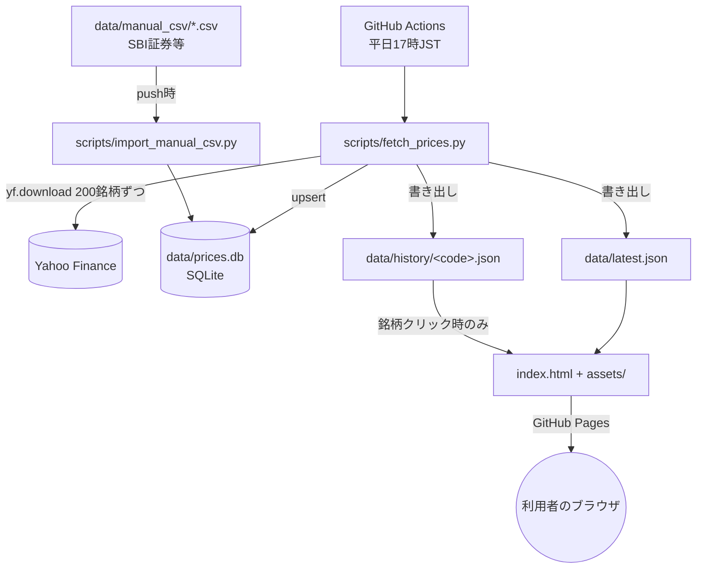
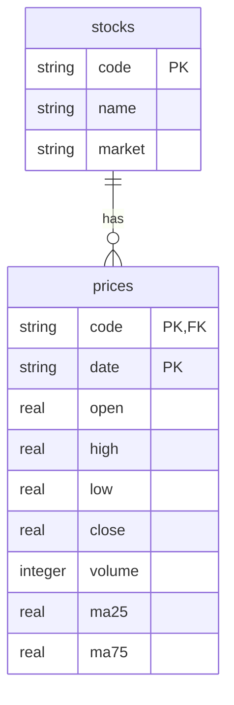
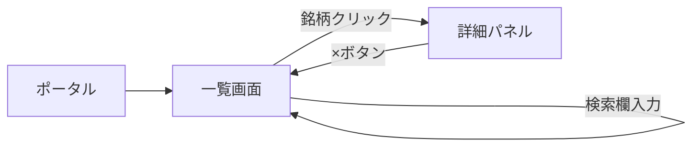

# 機能設計書 — 東証株価データベース

## システム構成

- バックエンドサーバーは存在しない。ブラウザが直接読むのは軽量な JSON 2ファイルのみ。
- `data/prices.db` はブラウザからは直接読まない、蓄積用の実データベース(将来SQLで分析する際の一次データ)。
- 定期バッチ(Actions)だけがサーバーサイド相当の処理を担う。

## データモデル

### 銘柄マスタ(静的、`stocks`テーブル)
| フィールド | 型 | 説明 |
|---|---|---|
| code | string | 証券コード(5桁表記。例 "13010" は 1301 のこと。末尾が桁揃え用のパディング) |
| name | string | 銘柄名(日本語) |
| market | string | 市場区分(例 "プライム") |

開発時にJ-Quants APIから一度取得した約4,449銘柄を土台としており、以後の自動同期はない
(`docs/architecture.md`の「銘柄マスタが静的である理由」を参照)。

### data/prices.db(SQLite・自動蓄積)

- `open/high/low/close/volume` は yfinance の調整済み株価(`auto_adjust=True`)。株式分割・配当を
  考慮済みのため、長期の移動平均が分割で不連続にならない。
- `prices` は `(code, date)` を主キーとし、upsert で蓄積する。ただしGitHubの100MB
  ファイルサイズ制限に収めるため、`PRUNE_RETENTION_DAYS`(既定200日)より古い行は
  毎回の実行時に削除される(`docs/architecture.md`の「データベースのサイズ管理」参照)。
- 実行のたびに全銘柄について直近6か月分を取り直すため、バックフィル専用のフラグは持たない。
  手動CSV取り込み(`import_manual_csv.py`)も同じテーブルにupsertする。

### data/latest.json(自動生成・フロントエンド用・一覧表示に使用)
| フィールド | 型 | 説明 |
|---|---|---|
| updated_at | string | 生成時刻(ISO8601, JST) |
| codes_with_data / codes_total | integer | データを取得できた銘柄数 / 全銘柄数 |
| items[] | array | 銘柄ごとの最新値 |
| items[].code / name / market | string | 銘柄情報 |
| items[].date | string\|null | 最新営業日(未取得の場合null) |
| items[].open/high/low/close | number\|null | 当日OHLC(調整済み) |
| items[].volume | integer\|null | 出来高 |
| items[].ma25 / ma75 | number\|null | 25日/75日移動平均 |
| items[].judgment | string | "高値圏" / "中立" / "安値圏" / "判定不可" / "未取得" |
| items[].reasons[] | string[] | 判定理由の説明文 |

### data/history/&lt;code&gt;.json(自動生成・銘柄クリック時に個別取得)
直近120営業日分の `{date, open, high, low, close, volume, ma25, ma75}` の配列。
全銘柄分をまとめず1銘柄1ファイルにすることで、一覧表示時には読み込まれない。

## 判定ロジック(高値圏 / 中立 / 安値圏)
- 終値 > MA25 かつ 終値 > MA75 → **高値圏**
- 終値 < MA25 かつ 終値 < MA75 → **安値圏**
- それ以外(MA25とMA75の間で綱引き) → **中立**
- MA25 または MA75 がまだ計算できない(データ不足) → **判定不可**

## 画面構成

単一ページ。一覧テーブルの下に、選択した銘柄の詳細パネル(チャート+直近20営業日テーブル)を表示する。

## コンポーネント設計(assets/app.js)

| 関数 | 役割 |
|---|---|
| `loadData()` | `latest.json` を取得し `state` に格納(詳細履歴は含まない) |
| `sortedFilteredItems()` | 検索語での絞り込みと現在のソートキーでの並び替え |
| `render()` | 一覧テーブルの再描画 |
| `setupSorting()` | 列見出しクリックでのソート切り替え |
| `fetchHistory(code)` | `data/history/<code>.json` をクリック時に取得しキャッシュ |
| `openDetail(code)` | 選択銘柄の詳細パネル(チャート・テーブル・判定理由)を表示 |
| `buildChart(rows)` | 終値・MA25・MA75の折れ線をSVGパスとして生成(外部チャートライブラリ不使用) |

## 定期バッチ(scripts/fetch_prices.py)
`docs/architecture.md` を参照。
