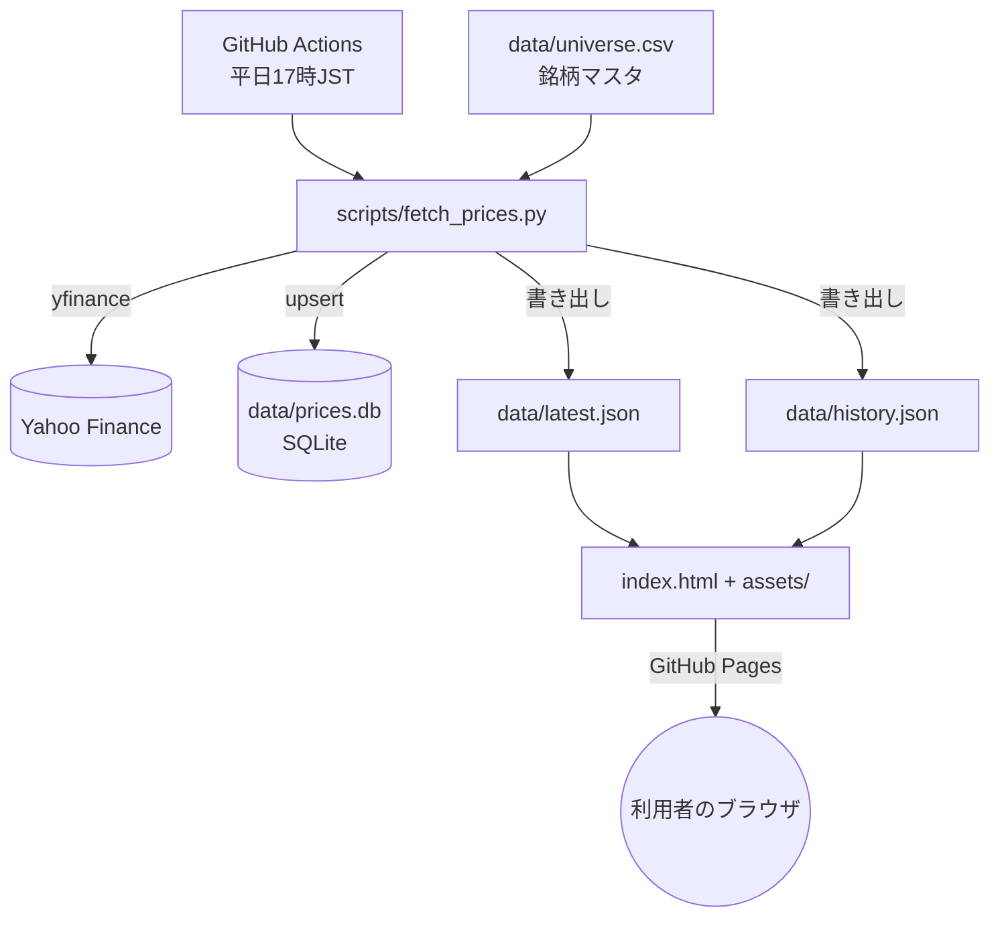
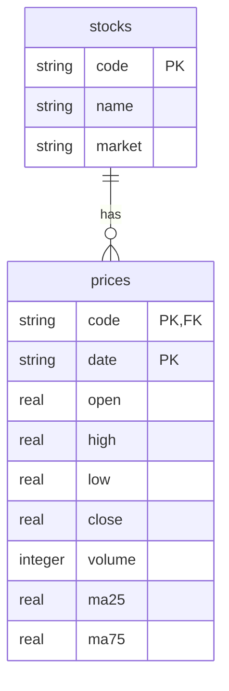
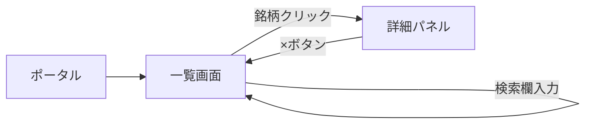

# 機能設計書 — 東証株価データベース

## システム構成

- バックエンドサーバーは存在しない。ブラウザが直接読むのは軽量な JSON 2ファイルのみ。
- `data/prices.db` はブラウザからは直接読まない、蓄積用の実データベース(将来SQLで分析する際の一次データ)。
- 定期バッチ(Actions)だけがサーバーサイド相当の処理を担う。

## データモデル

### data/universe.csv(固定・手動管理)
| フィールド | 型 | 説明 |
|---|---|---|
| code | string | 証券コード(例 "7203") |
| name | string | 銘柄名 |
| market | string | 市場区分(例 "プライム") |

### data/prices.db(SQLite・自動蓄積)

- `prices` は `(code, date)` を主キーとし、実行のたびに直近1年分を upsert する。
- 過去に取得済みでも今回の取得期間(1年)より古い日付の行は削除しないため、運用を続けるほど蓄積される。

### data/latest.json(自動生成・フロントエンド用)
| フィールド | 型 | 説明 |
|---|---|---|
| updated_at | string | 生成時刻(ISO8601, JST) |
| items[] | array | 銘柄ごとの最新値 |
| items[].code / name / market | string | 銘柄情報 |
| items[].date | string | 最新営業日 |
| items[].open/high/low/close | number\|null | 当日OHLC |
| items[].volume | integer\|null | 出来高 |
| items[].ma25 / ma75 | number\|null | 25日/75日移動平均 |
| items[].judgment | string | "高値圏" / "中立" / "安値圏" / "判定不可" / "取得失敗" |
| items[].reasons[] | string[] | 判定理由の説明文 |

### data/history.json(自動生成・フロントエンド用)
| フィールド | 型 | 説明 |
|---|---|---|
| updated_at | string | 生成時刻 |
| history | object | `{ 証券コード: [直近120営業日分の日足+MA25/MA75] }` |

## 判定ロジック(高値圏 / 中立 / 安値圏)
- 終値 > MA25 かつ 終値 > MA75 → **高値圏**
- 終値 < MA25 かつ 終値 < MA75 → **安値圏**
- それ以外(MA25とMA75の間で綱引き) → **中立**
- MA25 または MA75 がまだ計算できない(データ不足) → **判定不可**

## 画面構成

単一ページ。一覧テーブルの下に、選択した銘柄の詳細パネル(チャート+直近20営業日テーブル)を表示する。

## コンポーネント設計(assets/app.js)

| 関数 | 役割 |
|---|---|
| `loadData()` | `latest.json` / `history.json` を取得し `state` に格納 |
| `sortedFilteredItems()` | 検索語での絞り込みと現在のソートキーでの並び替え |
| `render()` | 一覧テーブルの再描画 |
| `setupSorting()` | 列見出しクリックでのソート切り替え |
| `openDetail(code)` | 選択銘柄の詳細パネル(チャート・テーブル・判定理由)を表示 |
| `buildChart(rows)` | 終値・MA25・MA75の折れ線をSVGパスとして生成(外部チャートライブラリ不使用) |

## 定期バッチ(scripts/fetch_prices.py)
`docs/architecture.md` を参照。
